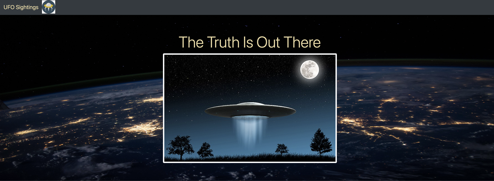
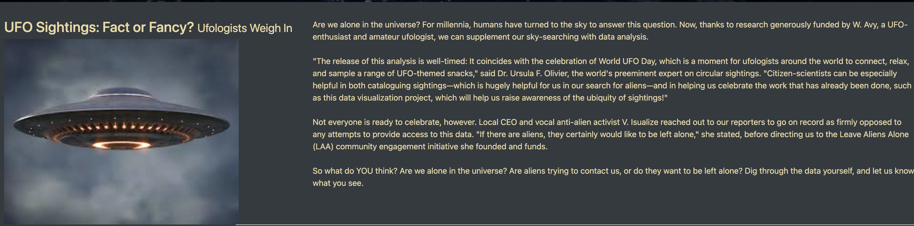

# UFO

UFO sightings with javaScript 👽

## Overview of Project:

The purpose of this project is to walk down the JavaScript lane and explore into its technical aspects and apply it to the field of data analytics and visualization. The ultimate goal is to use JavaScript, HTML, CSS and D3.js to create table dynamically from a dataset with UFO sightings in USA, where a curious user can search and filter the data for specific values👽

## Results: 

### Building the HTML page with a Data table.

This project triggered off by creating a HTML page by using javaScript and the webpage contains a paragraph on UFO sightings: Facts or Fancy. The webpage also contains a dynamic table , which is created from javascript data(data.js) on UFO sightings details in USA👽

The dynamic table is further polished to provide a more in-depth analysis of UFO sightings by allowing curious users to filter for multiple criteria at the same time.There are 5 different filters to choose from; the Date, City, State, Country & Shape of the saucer.The example above shows sightings in 4 different Texas cities in 2010, their duration, shape and comments on the sightings. The filters are created in such a manner that multiple filters can also be entered at the same time to obtain specific informations👽

## Summary:

The website was created successfully with a dynamic table along with multiple filters.
* One disadvantage of this webpage is, the date filter. Rather than making the placeholder (mm/dd/yyyy) very specific, it should have been filtered only by the year (yyyy). This search would result in more informations being delivered at a shorter time. From this point the user can use more filters to narrow down the search. If a particular date entered is not in the table then the user will be disapointed👽

* Two additional recommendations for further development:

* Some extra features that I have incorporated to make the website look attractive is incorporating images
    * One image thumbnail was added in the Jumbotron and positioned at the center.  
    * Another image of a saucer was added in the fluid container of header 3 (h3).By incorporating a fluid container in h3 makes the picture more dynamic. As the viewer's device changes, the picture adjusts itself in the fluid container.  
    * Links to the full article can also be added to each individual row, so if an user whats to learn more about a sighting, they can click on that link and get more information from the original article👽👽
    

